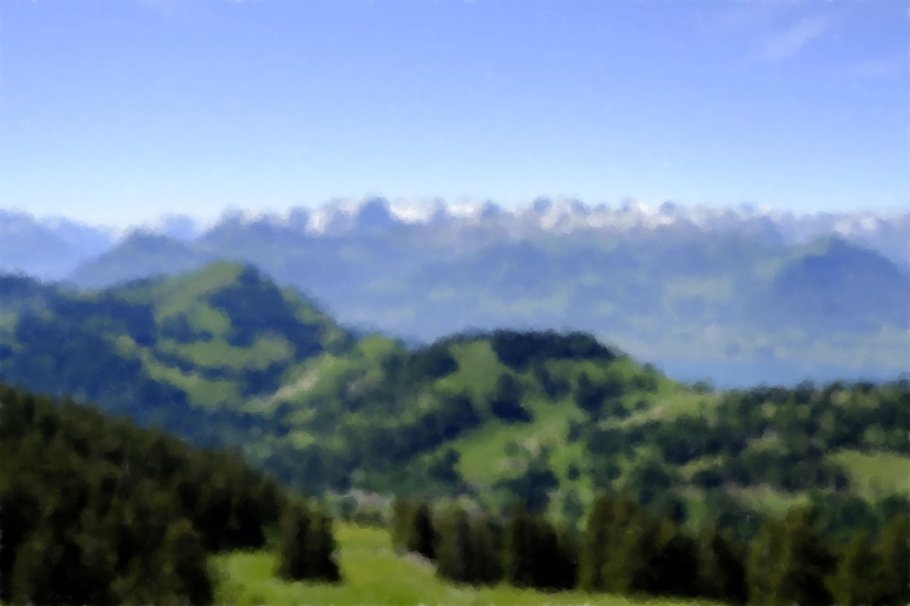

# Abstractify

---

Abstractify is a simple web app that creates an abstract version of an image.  
This project was put together for an exhibition organised by my school's Art Elective Programme to showcase teachers' passions and endeavours beyond their roles in school.

## Acknowledgements
- [Generative Art in Go](https://preslav.me/generative-art-in-golang/) by [Preslav Rachev](https://github.com/preslavrachev)
- [Go Graphics](https://github.com/fogleman/gg)
- [Pico.css](https://github.com/picocss/pico)
- [notie](https://github.com/jaredreich/notie)
